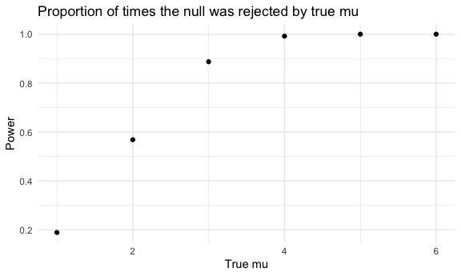
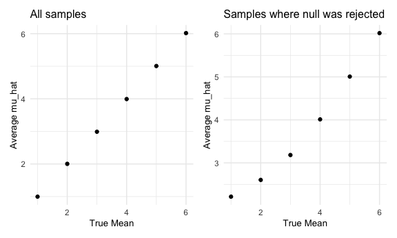

Homework 5
================
Maya Bunyan

This my solution to Homework 5\!

# Problem 1

Read in the data

``` r
homicide_df = 
  read_csv("./homicide_data/homicide-data.csv") %>%
  mutate (
    city_state = str_c(city, state, sep = "_"),
    resolved = case_when(
      disposition == "Closed without arrest" ~ "unsolved",
      disposition == "Open/No arrest"        ~ "unsolved",
      disposition == "Closed by arrest"      ~ "solved"
    )
  ) %>%
  select(city_state, resolved) %>% 
  filter(city_state != "Tulsa_AL")
```

    ## Parsed with column specification:
    ## cols(
    ##   uid = col_character(),
    ##   reported_date = col_double(),
    ##   victim_last = col_character(),
    ##   victim_first = col_character(),
    ##   victim_race = col_character(),
    ##   victim_age = col_character(),
    ##   victim_sex = col_character(),
    ##   city = col_character(),
    ##   state = col_character(),
    ##   lat = col_double(),
    ##   lon = col_double(),
    ##   disposition = col_character()
    ## )

Look more at the data.

``` r
aggregate_df = 
  homicide_df %>%
  group_by(city_state) %>% 
  summarize(
    hom_total = n(),
    hom_unsolved = sum(resolved == "unsolved")
  )
```

    ## `summarise()` ungrouping output (override with `.groups` argument)

Prop test for a single city.

``` r
prop.test(
  aggregate_df %>% filter(city_state == "Baltimore_MD") %>%  pull(hom_unsolved),
  aggregate_df %>% filter(city_state == "Baltimore_MD") %>%  pull(hom_total)) %>% 
  broom::tidy()
```

    ## # A tibble: 1 x 8
    ##   estimate statistic  p.value parameter conf.low conf.high method    alternative
    ##      <dbl>     <dbl>    <dbl>     <int>    <dbl>     <dbl> <chr>     <chr>      
    ## 1    0.646      239. 6.46e-54         1    0.628     0.663 1-sample… two.sided

Try to iterate

``` r
results_df = 
  aggregate_df %>% 
  mutate(
    prop_tests = map2(.x = hom_unsolved, .y = hom_total, ~prop.test(x = .x, n = .y)),
    tidy_tests = map(.x = prop_tests, ~broom::tidy(.x))
  ) %>% 
  select(-prop_tests) %>%
  unnest(tidy_tests) %>%
  select(city_state, estimate, conf.low, conf.high)
```

``` r
results_df %>% 
  mutate(city_state = fct_reorder(city_state, estimate)) %>% 
  ggplot(aes(x = city_state, y = estimate)) +
  geom_point() + 
  geom_errorbar(aes(ymin = conf.low, ymax = conf.high)) + 
  theme(axis.text.x = element_text(angle = 90, vjust = 0.5, hjust = 1))
```


# Problem 2

Import and tidy the data

``` r
path_df = 
  tibble(
    path = list.files("lda_data")
  ) %>% 
  mutate(
    path_name = str_c("lda_data/", path),
    data = map(.x = path_name, ~read_csv(.x))
  ) %>%
  unnest(data) %>%
  select(-path_name) %>%
  separate(
    col = path,
    into = c("treatment_arm", "subject_id", "csv"),
    convert = T
  ) %>%
  select(-csv) %>%
  pivot_longer(
    week_1:week_8,
    names_to = "week",
    names_prefix = "week_",
    values_to = "obs"
  ) %>% 
    mutate(
    treatment_arm = recode(treatment_arm, con = "control", exp = "experimental"),
    week = as.numeric(week)
  ) 
```

    ## Parsed with column specification:
    ## cols(
    ##   week_1 = col_double(),
    ##   week_2 = col_double(),
    ##   week_3 = col_double(),
    ##   week_4 = col_double(),
    ##   week_5 = col_double(),
    ##   week_6 = col_double(),
    ##   week_7 = col_double(),
    ##   week_8 = col_double()
    ## )
    ## Parsed with column specification:
    ## cols(
    ##   week_1 = col_double(),
    ##   week_2 = col_double(),
    ##   week_3 = col_double(),
    ##   week_4 = col_double(),
    ##   week_5 = col_double(),
    ##   week_6 = col_double(),
    ##   week_7 = col_double(),
    ##   week_8 = col_double()
    ## )
    ## Parsed with column specification:
    ## cols(
    ##   week_1 = col_double(),
    ##   week_2 = col_double(),
    ##   week_3 = col_double(),
    ##   week_4 = col_double(),
    ##   week_5 = col_double(),
    ##   week_6 = col_double(),
    ##   week_7 = col_double(),
    ##   week_8 = col_double()
    ## )
    ## Parsed with column specification:
    ## cols(
    ##   week_1 = col_double(),
    ##   week_2 = col_double(),
    ##   week_3 = col_double(),
    ##   week_4 = col_double(),
    ##   week_5 = col_double(),
    ##   week_6 = col_double(),
    ##   week_7 = col_double(),
    ##   week_8 = col_double()
    ## )
    ## Parsed with column specification:
    ## cols(
    ##   week_1 = col_double(),
    ##   week_2 = col_double(),
    ##   week_3 = col_double(),
    ##   week_4 = col_double(),
    ##   week_5 = col_double(),
    ##   week_6 = col_double(),
    ##   week_7 = col_double(),
    ##   week_8 = col_double()
    ## )
    ## Parsed with column specification:
    ## cols(
    ##   week_1 = col_double(),
    ##   week_2 = col_double(),
    ##   week_3 = col_double(),
    ##   week_4 = col_double(),
    ##   week_5 = col_double(),
    ##   week_6 = col_double(),
    ##   week_7 = col_double(),
    ##   week_8 = col_double()
    ## )
    ## Parsed with column specification:
    ## cols(
    ##   week_1 = col_double(),
    ##   week_2 = col_double(),
    ##   week_3 = col_double(),
    ##   week_4 = col_double(),
    ##   week_5 = col_double(),
    ##   week_6 = col_double(),
    ##   week_7 = col_double(),
    ##   week_8 = col_double()
    ## )
    ## Parsed with column specification:
    ## cols(
    ##   week_1 = col_double(),
    ##   week_2 = col_double(),
    ##   week_3 = col_double(),
    ##   week_4 = col_double(),
    ##   week_5 = col_double(),
    ##   week_6 = col_double(),
    ##   week_7 = col_double(),
    ##   week_8 = col_double()
    ## )
    ## Parsed with column specification:
    ## cols(
    ##   week_1 = col_double(),
    ##   week_2 = col_double(),
    ##   week_3 = col_double(),
    ##   week_4 = col_double(),
    ##   week_5 = col_double(),
    ##   week_6 = col_double(),
    ##   week_7 = col_double(),
    ##   week_8 = col_double()
    ## )
    ## Parsed with column specification:
    ## cols(
    ##   week_1 = col_double(),
    ##   week_2 = col_double(),
    ##   week_3 = col_double(),
    ##   week_4 = col_double(),
    ##   week_5 = col_double(),
    ##   week_6 = col_double(),
    ##   week_7 = col_double(),
    ##   week_8 = col_double()
    ## )
    ## Parsed with column specification:
    ## cols(
    ##   week_1 = col_double(),
    ##   week_2 = col_double(),
    ##   week_3 = col_double(),
    ##   week_4 = col_double(),
    ##   week_5 = col_double(),
    ##   week_6 = col_double(),
    ##   week_7 = col_double(),
    ##   week_8 = col_double()
    ## )
    ## Parsed with column specification:
    ## cols(
    ##   week_1 = col_double(),
    ##   week_2 = col_double(),
    ##   week_3 = col_double(),
    ##   week_4 = col_double(),
    ##   week_5 = col_double(),
    ##   week_6 = col_double(),
    ##   week_7 = col_double(),
    ##   week_8 = col_double()
    ## )
    ## Parsed with column specification:
    ## cols(
    ##   week_1 = col_double(),
    ##   week_2 = col_double(),
    ##   week_3 = col_double(),
    ##   week_4 = col_double(),
    ##   week_5 = col_double(),
    ##   week_6 = col_double(),
    ##   week_7 = col_double(),
    ##   week_8 = col_double()
    ## )
    ## Parsed with column specification:
    ## cols(
    ##   week_1 = col_double(),
    ##   week_2 = col_double(),
    ##   week_3 = col_double(),
    ##   week_4 = col_double(),
    ##   week_5 = col_double(),
    ##   week_6 = col_double(),
    ##   week_7 = col_double(),
    ##   week_8 = col_double()
    ## )
    ## Parsed with column specification:
    ## cols(
    ##   week_1 = col_double(),
    ##   week_2 = col_double(),
    ##   week_3 = col_double(),
    ##   week_4 = col_double(),
    ##   week_5 = col_double(),
    ##   week_6 = col_double(),
    ##   week_7 = col_double(),
    ##   week_8 = col_double()
    ## )
    ## Parsed with column specification:
    ## cols(
    ##   week_1 = col_double(),
    ##   week_2 = col_double(),
    ##   week_3 = col_double(),
    ##   week_4 = col_double(),
    ##   week_5 = col_double(),
    ##   week_6 = col_double(),
    ##   week_7 = col_double(),
    ##   week_8 = col_double()
    ## )
    ## Parsed with column specification:
    ## cols(
    ##   week_1 = col_double(),
    ##   week_2 = col_double(),
    ##   week_3 = col_double(),
    ##   week_4 = col_double(),
    ##   week_5 = col_double(),
    ##   week_6 = col_double(),
    ##   week_7 = col_double(),
    ##   week_8 = col_double()
    ## )
    ## Parsed with column specification:
    ## cols(
    ##   week_1 = col_double(),
    ##   week_2 = col_double(),
    ##   week_3 = col_double(),
    ##   week_4 = col_double(),
    ##   week_5 = col_double(),
    ##   week_6 = col_double(),
    ##   week_7 = col_double(),
    ##   week_8 = col_double()
    ## )
    ## Parsed with column specification:
    ## cols(
    ##   week_1 = col_double(),
    ##   week_2 = col_double(),
    ##   week_3 = col_double(),
    ##   week_4 = col_double(),
    ##   week_5 = col_double(),
    ##   week_6 = col_double(),
    ##   week_7 = col_double(),
    ##   week_8 = col_double()
    ## )
    ## Parsed with column specification:
    ## cols(
    ##   week_1 = col_double(),
    ##   week_2 = col_double(),
    ##   week_3 = col_double(),
    ##   week_4 = col_double(),
    ##   week_5 = col_double(),
    ##   week_6 = col_double(),
    ##   week_7 = col_double(),
    ##   week_8 = col_double()
    ## )

Create spaghetti plot showing observations on each subject over time

``` r
path_df %>% 
  ggplot(aes(x = week, y = obs, group = subject_id, color = subject_id)) +
  geom_point() +
  geom_line() +
  facet_grid(. ~ treatment_arm)
```


From the graph, we see that overall, the observations appear to be
relatively constant over time for the control group. However, for the
experimental arm, the observations appear to be increasing over time.

# Problem 3

Create function for simulation for when mu = 0.

``` r
sim_ttest = function(mu, n = 30, sd = 5) {
  sim_data = 
    tibble(
      x = rnorm(n = n, mean = mu, sd = sd)
    )
  
  ttest_results = 
    sim_data %>%
    t.test() %>%
    broom::tidy() %>% 
    select(estimate, p.value)
}
```

Generate 5000 datasets.

``` r
sim_test_one_results = 
  rerun(5000, sim_ttest(mu = 0)) %>%
  bind_rows()
```

Use the above function for mu in 1:6.

``` r
sim_ttest_six_results = 
  tibble(
    mu = c(1:6)
  ) %>% 
  mutate(
    output_lists = map(.x = mu, ~rerun(5000, sim_ttest(mu =.x))),
    estimate_df = map(output_lists, bind_rows)
  ) %>% 
  select(-output_lists) %>% 
  unnest(estimate_df)
```

Create new variable for rejected or not rejected.

``` r
sim_data_final = 
  sim_ttest_six_results %>%
  mutate(
    decision = case_when(
      p.value <= 0.05 ~ "reject",
      p.value > 0.05  ~ "fail to reject"
    )
  )
```

Plot proportion of times the null was rejects by true value of mu.

``` r
plot1 = 
  sim_data_final %>%
  group_by(mu) %>%
  summarize(
    prop_rej = (sum(decision == "reject"))/n()
  ) 
```

    ## `summarise()` ungrouping output (override with `.groups` argument)

``` r
ggplot(data = plot1, aes(x = mu, y = prop_rej )) + 
  geom_point() +
  labs(x = "True mu", y = "Power", title = "Proportion of times the null was rejected by true mu")
```



From the graph we see that as the effect size gets larger (true mu gets
further from the null value of 0), the power increases rapidly and
plateaus as it reaches 1.

Plot average of the estimates by true value and average of estimates
where null was rejected by true value.

``` r
avg_est = 
  sim_data_final %>%
  group_by(mu) %>%
  summarize(
    avg_estimate = mean(estimate)
  ) %>%
  ggplot(aes(x = mu, y = avg_estimate)) + 
  geom_point() +
  labs(x = "True Mean", y = "Average mu_hat", title = "All samples") +
  theme(title = element_text(size = 10))
```

    ## `summarise()` ungrouping output (override with `.groups` argument)

``` r
avg_est_rejected = 
  sim_data_final %>%
  filter(decision == "reject") %>%
  group_by(mu) %>%
  summarize(
    avg_estimate_rej = mean(estimate)
  ) %>%
  ggplot(aes(x = mu, y = avg_estimate_rej)) + 
  geom_point() +
  labs(x = "True Mean", y = "Average mu_hat", title = "Samples where null was rejected") +
  theme(title = element_text(size = 10))
```

    ## `summarise()` ungrouping output (override with `.groups` argument)

``` r
avg_est + avg_est_rejected
```



The sample average of mu hat across tests for which the null is rejected
is approximately equal to the true value of mu the further away the true
mu is from the null value of mu = 0.

This is because we are testing whether the average value from the
dataset we created is or is not different from the null value, 0. If the
observed average value is significantly different from the null value,
then we would reject the null hypothesis.

For each dataset, we are generating a random sample with the mean being
the true mu and standard deviation equal to 5. From this random sample,
we generate an estimated sample mean. When generated multiple times and
given that CLT is satisfied since sample size is 30, the distribution of
sample means will be normally distributed around the true mu we used to
generate the sample.

When the true mu is close to the null and depending on the standard
deviation, it is more likely that you will reject only when the
estimates for the dataset are more extreme or further from the true
value, which is why the average of the estimates among those that were
rejected is different than the true mu for when the true mu is equal to
1, 2, and 3. However, as the true mu gets further away from the null
value, we are more likely to reject for the average estimate when it is
close to the true mu rather than the more extreme values, as the true mu
itself is different from the null value.
